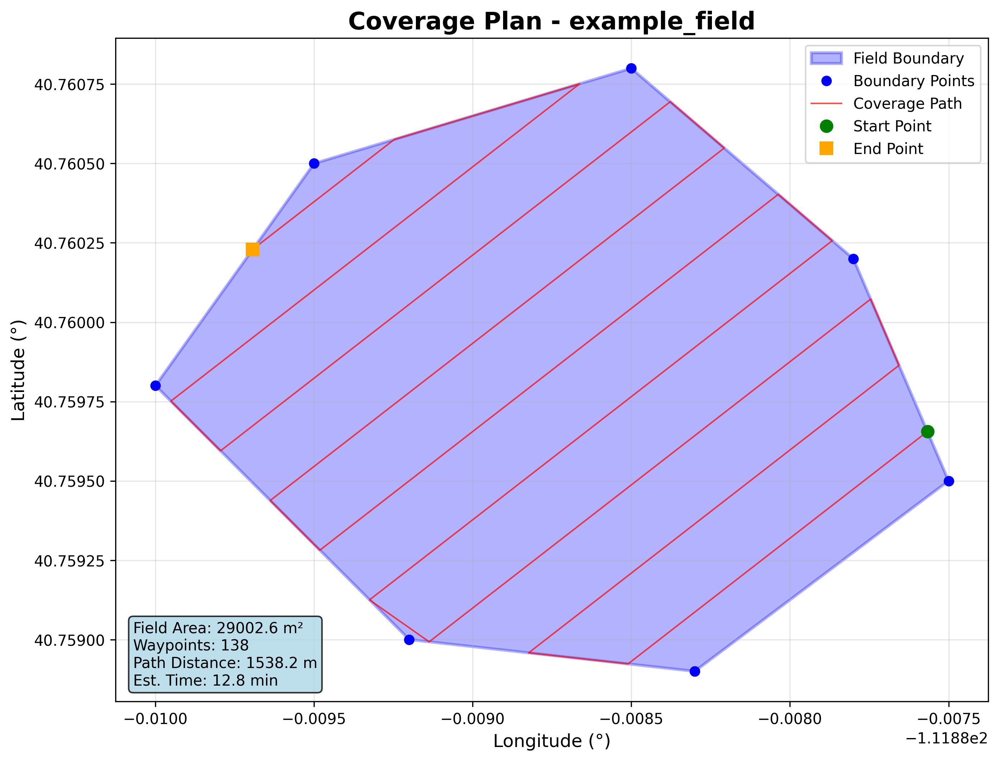

# 🚁 Field Coverage Planner

[![License: M### Option 2: Install as Package

#### **🍎 macOS / 🐧 Linux**
```bash
# Install with pip (optional)
pip3 install -e .

# Then use the installed command
field-coverage
field-coverage your_field.csv output_waypoints.csv
```

#### **🪟 Windows**
```cmd
REM Install with pip (optional)
pip install -e .

REM Then use the installed command
field-coverage
field-coverage your_field.csv output_waypoints.csv
```

### 🔄 Keeping Up to Date

When you make changes to the code, you need to update the system installation:

#### **🍎 macOS / 🐧 Linux**
```bash
# Option 1: Use the update script (recommended)
./update.sh

# Option 2: Manual reinstallation
pip3 uninstall field-coverage-planner -y && pip3 install -e .
```

#### **🪟 Windows**
```cmd
REM Option 1: Use the update script (recommended)
update.bat

REM Option 2: Manual reinstallation
pip uninstall field-coverage-planner -y && pip install -e .
```

**Why update?** The `field-coverage` system command needs to be synced with code changes, while direct execution always uses the latest code.//img.shields.io/badge/License-MIT-yellow.svg)](https://opensource.org/licenses/MIT)
[](https://www.python.org/downloads/)

**Advanced agricultural field coverage path planning system with intelligent optimization**



## 🎯 Features

- **🤖 Intelligent Direction Optimization**: Automatically finds the optimal coverage direction to minimize path length
- **⭐ Visual Feedback**: Star emoji marking shows optimal directions during optimization
- **🚀 User-Friendly CLI**: Run with default parameters or customize everything
- **📊 Complex Field Support**: Handles any polygon shape (tested with 7+ edge fields)
- **🔍 Configurable Precision**: Adjustable optimization step sizes (1° to 30°)
- **📈 Real-time Visualization**: Generates plots and statistics automatically
- **✅ Comprehensive Validation**: Built-in waypoint and field validation
- **🔧 Easy Installation**: Simple pip install with all dependencies

## 🚀 Quick Start

### 🌍 Cross-Platform Support
This project works on **Windows**, **macOS**, and **Linux/Ubuntu**. Choose your platform:

#### **🍎 macOS / 🐧 Linux**
```bash
# Clone the repository
git clone https://github.com/SDNT8810/field-coverage-planner.git
cd field-coverage-planner

# Install dependencies only
pip3 install -r requirements.txt

# Run directly with Python
python3 run.py

# Use your own GPS field data
python3 run.py your_field.csv output_waypoints.csv

# With custom parameters
python3 run.py field.csv --swath-width 2.5 --overlap 0.15 --optimization-step 5
```

#### **🪟 Windows**
```cmd
REM Clone the repository
git clone https://github.com/SDNT8810/field-coverage-planner.git
cd field-coverage-planner

REM Install dependencies only
pip install -r requirements.txt

REM Run directly with Python
python run.py
REM OR use the batch script
run.bat

REM Use your own GPS field data
python run.py your_field.csv output_waypoints.csv
REM OR
run.bat your_field.csv output_waypoints.csv
```

### Option 2: Install as Package

```bash
# Install with pip (optional)
pip install -e .

# Then use the installed command
field-coverage
field-coverage your_field.csv output_waypoints.csv
```

### ⚡ Quick Examples

#### **🍎 macOS / 🐧 Linux**
```bash
# Run with defaults (uses example field data)
python3 run.py

# Custom field with optimized settings
python3 run.py my_field.csv my_output.csv --swath-width 3.0 --optimization-step 5

# Generate plot without showing window
python3 run.py --no-show-plot --plot-output my_plot.png

# Verbose output with validation
python3 run.py --verbose --validate
```

#### **🪟 Windows**
```cmd
REM Run with defaults (uses example field data)
python run.py
REM OR
run.bat

REM Custom field with optimized settings
python run.py my_field.csv my_output.csv --swath-width 3.0 --optimization-step 5

REM Generate plot without showing window
run.bat --no-show-plot --plot-output my_plot.png
```

## ⚙️ Configuration System

The system uses a **3-level priority system**:

1. **Command Line Arguments** (highest priority)
2. **YAML Configuration File** (`config/defaults.yaml`)  
3. **Hardcoded Defaults** (lowest priority)

### Configuration File

Edit `config/defaults.yaml` to set your preferred defaults:

```yaml
# Coverage Parameters
swath_width: 3.0          # Swath width in meters
overlap: 0.1              # Overlap percentage (0.1 = 10%)
turn_radius: 2.0          # Minimum turning radius in meters  
speed: 2.0                # Default waypoint speed in m/s
optimization_step: 15.0   # Step size for optimization in degrees

# Input/Output (paths relative to project root)
input_file: "data/example_field.csv"
output_file: "output/coverage_result.csv"
plot_output: "output/field_coverage_plot.png"
```

The system automatically finds the project root and works from any directory:

```bash
# Works from anywhere!
cd /tmp
python3 /path/to/Coverage_Path_Planning/run.py --verbose
```

## 🔍 Platform Verification

Before using the system, you can verify compatibility on your platform:

#### **🍎 macOS / 🐧 Linux**
```bash
python3 tests/check_compatibility.py
```

#### **🪟 Windows**
```cmd
python tests/check_compatibility.py
```

This will check:
- ✅ Python version compatibility (3.8+)
- ✅ All required dependencies  
- ✅ Project structure integrity
- ✅ Basic functionality tests
- ✅ Command line interface

**📚 Full compatibility guide**: See `docs/CROSS_PLATFORM_COMPATIBILITY.md` for detailed platform-specific information.

## 📋 Input Format

Your CSV file should contain GPS coordinates with `latitude,longitude` columns:

```csv
latitude,longitude
40.7128,-74.0060
40.7158,-74.0060
40.7168,-74.0040
40.7148,-74.0030
40.7138,-74.0040
40.7128,-74.0060
```

## 🛠️ Command Line Options

```bash
# Using direct runner script
python3 run.py [input_file] [output_file] [options]

# Or if installed as package
field-coverage [input_file] [output_file] [options]

Positional Arguments:
  input_file            GPS coordinates CSV file (default: data/example_field.csv)
  output_file           Output waypoints CSV file (default: output/coverage_result.csv)

Coverage Parameters:
  --swath-width FLOAT   Swath width in meters (default: 3.0)
  --overlap FLOAT       Overlap percentage as decimal (default: 0.1)
  --turn-radius FLOAT   Minimum turning radius in meters (default: 2.0)
  --speed FLOAT         Default waypoint speed in m/s (default: 2.0)

Optimization:
  --direction FLOAT     Fixed coverage direction in degrees (0=North, 90=East)
  --optimization-step   Step size for optimization in degrees (default: 15.0)
                       Smaller values = more precise but slower

Output Options:
  --plot               Generate visualization plot (default: True)
  --plot-output PATH   Plot output path (default: output/field_coverage_plot.png)
  --no-show-plot       Don't display plot window (default)
  --validate           Validate waypoints (default: True)
  --verbose            Enable verbose output (default: True)
```

## 📊 Example Results

The system automatically optimizes coverage direction and provides detailed statistics:

```
🔍 Optimizing coverage direction...
  Testing 12 directions (step: 15.0°)...
    Direction    0.0°:  11056.9m total path
    Direction   15.0°:  11039.9m total path
    Direction   30.0°:  11038.0m total path
    Direction   45.0°:  10989.0m total path ⭐
    Direction   60.0°:  11032.7m total path
    Direction   75.0°:  11055.4m total path
    Direction   90.0°:  11054.0m total path
    Direction  105.0°:  11012.3m total path
    Direction  120.0°:  11050.5m total path
    Direction  135.0°:  11039.3m total path
    Direction  150.0°:  11050.3m total path
    Direction  165.0°:  11041.7m total path
  Best direction: 45.0° with 10989.0m total path
✓ Optimal direction found: 45.0°

Field Area: 29,003 m² (2.9 hectares)
Generated: 1,117 waypoints
Total Distance: 10,989 m (11.0 km)
Estimated Time: 91.6 minutes
```

## 🏗️ Project Structure

```
field-coverage-planner/
├── run.py                      # 🎯 Direct runner script (no installation needed)
├── src/field_coverage/         # Main package
│   ├── algorithms/             # Coverage algorithms
│   │   └── boustrophedon.py   # Boustrophedon pattern generator
│   ├── core/                  # Core classes
│   │   ├── field.py          # Field representation
│   │   ├── waypoint.py       # Waypoint sequences
│   │   └── coordinates.py    # GPS coordinate handling
│   ├── utils/                 # Utilities
│   │   ├── geometry.py       # Geometric calculations
│   │   └── validation.py     # Data validation
│   ├── visualization/         # Plotting and visualization
│   │   └── field_plotter.py  # Matplotlib-based plotting
│   ├── io/                    # Input/output handling
│   │   ├── csv_handler.py    # CSV file operations
│   │   └── ros_handler.py    # ROS integration (future)
│   ├── cli.py                 # Command line interface
│   └── main.py                # Main planner class
├── data/                      # Example datasets
│   └── example_field.csv     # 7-edge polygon example
├── docs/                      # Documentation
│   ├── images/               # Documentation images
│   ├── CHANGELOG.md          # Project changelog
│   ├── CROSS_PLATFORM_COMPATIBILITY.md
│   ├── IMPLEMENTATION_SUMMARY.md
│   ├── PROJECT_STATUS.md
│   └── TODO.md
├── examples/                  # Usage examples
├── tests/                     # Unit tests
│   ├── test_basic.py         # Basic functionality tests
│   └── test_optimization.py  # Optimization algorithm tests
├── requirements.txt           # Python dependencies
├── setup.py                   # Package setup
├── LICENSE                    # MIT License
└── README.md                  # This file
```

## 🧪 Development

### Running Tests

```bash
# Run basic tests
python3 -m pytest tests/

# Test optimization algorithm specifically
python3 tests/test_optimization.py

# Run from any directory
cd tests && python3 test_optimization.py
```

### Contributing

1. Fork the repository
2. Create a feature branch: `git checkout -b feature-name`
3. Make your changes and add tests
4. Commit your changes: `git commit -am 'Add feature'`
5. Push to the branch: `git push origin feature-name`
6. Submit a pull request

## 📚 Algorithm Details

### Boustrophedon Pattern
- Generates parallel coverage paths with U-turns at field boundaries
- Intelligent direction optimization minimizes total path length
- Handles complex polygon shapes with obstacle avoidance
- Configurable overlap and swath width for different applications

### Optimization Process
1. **Direction Testing**: Tests multiple directions (configurable step size)
2. **Path Generation**: Creates boustrophedon pattern for each direction
3. **Distance Calculation**: Measures total path length including turns
4. **Best Selection**: Chooses direction with minimum total distance
5. **Visual Feedback**: Marks optimal direction with star emoji ⭐

## 🔧 Requirements

- Python 3.8+
- NumPy
- Matplotlib
- Shapely
- Click (for CLI)

## � Documentation

- **[CHANGELOG.md](docs/CHANGELOG.md)** - Version history and release notes
- **[IMPLEMENTATION_SUMMARY.md](docs/IMPLEMENTATION_SUMMARY.md)** - Technical implementation details
- **[CROSS_PLATFORM_COMPATIBILITY.md](docs/CROSS_PLATFORM_COMPATIBILITY.md)** - Platform-specific information
- **[PROJECT_STATUS.md](docs/PROJECT_STATUS.md)** - Current project status
- **[TODO.md](docs/TODO.md)** - Future development plans

## �📄 License

This project is licensed under the MIT License - see the [LICENSE](LICENSE) file for details.

## 👨‍💻 Author

**Davoud Nikkhouy** (@SDNT8810)
- Email: davoudnikkhouy@gmail.com
- GitHub: [SDNT8810](https://github.com/SDNT8810)

## 🙏 Acknowledgments

- Built for agricultural automation and precision farming applications
- Supports UAV/drone path planning workflows
- Compatible with various field management systems

---

⭐ **If this project helps you, please give it a star!** ⭐
